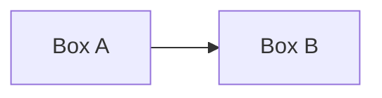

<!--
  Starter content for a Markdown-authored post.

  - Delete content.html if you're writing Markdown (keep only one of the two).
  - Only ## headings become Table of Contents entries.
  - Fenced ```mermaid code blocks are rendered as diagrams automatically.
  - Standard Markdown tables work as-is.
  - hero.html is optional — delete it if you don't want a hero illustration.
-->

## First section heading

Regular paragraph content goes here — normal Markdown, including **bold**,
_italics_, and [links](https://example.com).

## A section with a diagram



## A section with a table

| Column A | Column B |
|----------|----------|
| Row 1    | Value    |
| Row 2    | Value    |

## Wrapping up

Closing thoughts.
