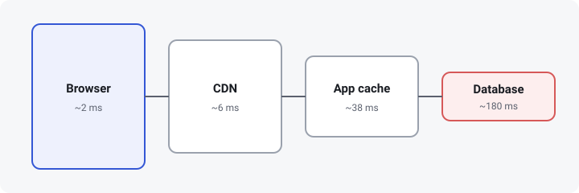
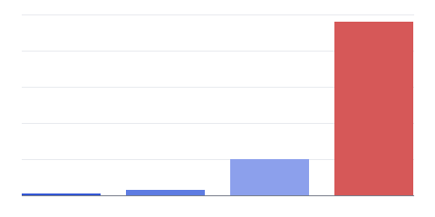
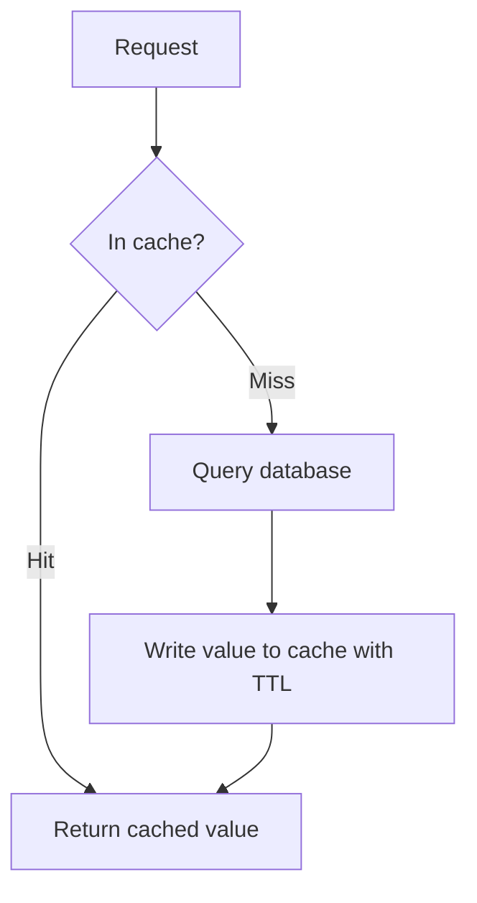
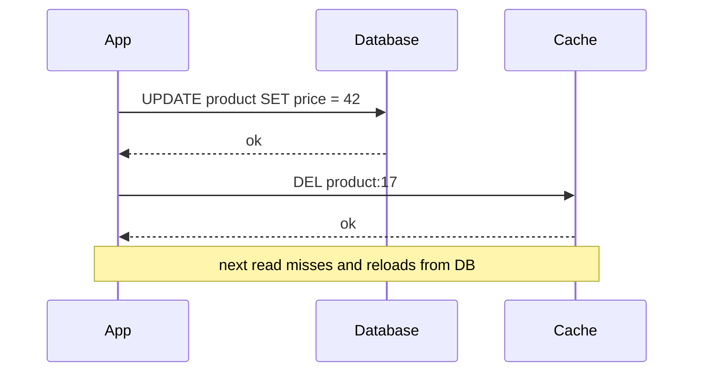
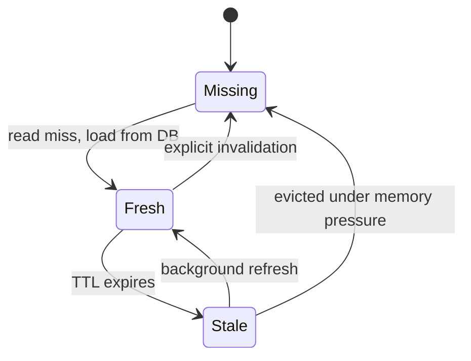

## Why stack caches?

Every layer between the user and the database is a chance to answer a request
without doing the expensive work. The closer to the user a hit happens, the
cheaper and faster it is — but the harder it is to invalidate.

## Latency by layer

Rough, made-up numbers for a single read that hits each layer:

| Layer | Typical hit latency | Invalidation |
| --- | --- | --- |
| Browser | ~2 ms | `Cache-Control`, versioned URLs |
| CDN | ~6 ms | Purge API, surrogate keys |
| App cache (Redis) | ~38 ms | Explicit delete, TTL |
| Database | ~180 ms | — (source of truth) |

## The read path

A cache-aside read checks the cache first and only falls through to the
database on a miss:

## The write path

Writes go to the database first, then invalidate the cache so the next read
repopulates it:

## Lifecycle of a cache entry

## Wrapping up

Cache as close to the user as the data's freshness requirements allow, and
decide how each layer is invalidated before you add it — not after the first
stale-price bug report.
