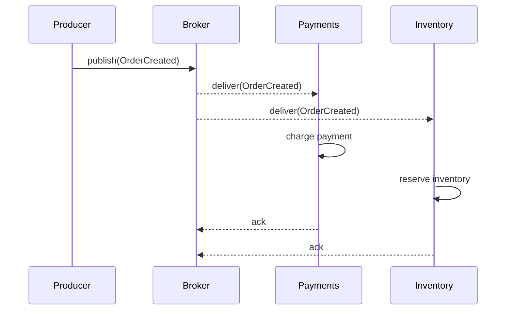
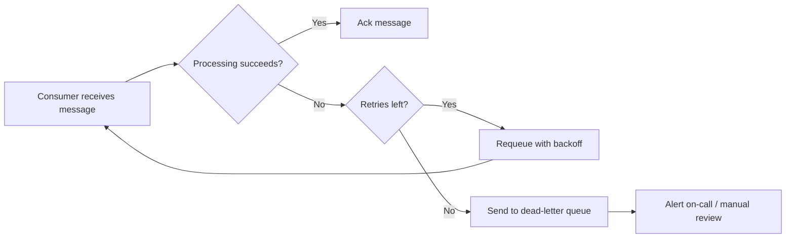

<figure class="post-hero">
  <svg viewBox="0 0 760 220" role="img" aria-labelledby="hero8-title">
    <title id="hero8-title">A producer connected through a broker to two independent consumers</title>
    <rect x="20" y="90" width="120" height="46" rx="8" class="dg-box" />
    <text x="80" y="113" class="dg-text-sm">Producer</text>

    <line x1="140" y1="113" x2="330" y2="70" class="dg-line" />
    <circle cx="380" cy="110" r="45" class="dg-box-accent" />
    <text x="380" y="110" class="dg-text">Broker</text>

    <line x1="430" y1="90" x2="600" y2="55" class="dg-line" />
    <line x1="430" y1="130" x2="600" y2="165" class="dg-line" />

    <rect x="610" y="30" width="130" height="46" rx="8" class="dg-box" />
    <text x="675" y="53" class="dg-text-sm">Payments</text>

    <rect x="610" y="142" width="130" height="46" rx="8" class="dg-box" />
    <text x="675" y="165" class="dg-text-sm">Inventory</text>
  </svg>
  <figcaption>One event, two consumers, zero coupling between them.</figcaption>
</figure>

## Why event-driven?

In a request/response system, a service calls another service and waits for an
answer. That's simple to reason about, and it falls apart the moment one
downstream call is slow — the caller waits too, and the failure propagates
straight back up the chain.

Event-driven architecture inverts that: instead of calling a service directly,
you publish a fact ("an order was created") and let anyone who cares about that
fact react to it, on their own schedule. The producer doesn't know or care who
is listening.

## The moving pieces

Every event-driven system boils down to three roles:

- **Producers** — publish events when something happens, and don't wait for a response.
- **Broker** — durably stores and routes events to whoever subscribed.
- **Consumers** — process events independently, at their own pace.

## A basic pub/sub flow

Here's what that looks like for a simple "order created" event with two
independent consumers:

Neither consumer blocks the other, and neither blocks the producer. If
Inventory is down for five minutes, Payments keeps working — the broker just
holds the message until Inventory comes back.

## Choosing a broker

The brokers people reach for most often trade off ordering guarantees,
delivery semantics, and operational complexity differently:

| Broker | Ordering guarantee | Delivery | Best for |
| --- | --- | --- | --- |
| Kafka | Per-partition order | At-least-once (configurable) | High-throughput event streams, replay from history |
| RabbitMQ | Per-queue order | At-least-once, exactly-once with plugins | Flexible routing, task queues, smaller scale |
| Amazon SQS | Best-effort (strict with FIFO queues) | At-least-once | Simple, fully managed, decoupled workers |

None of these is universally "best" — a system that needs to replay a year of
history wants Kafka; a system that just needs a reliable task queue for a few
background jobs is usually over-served by it.

## Failure modes to design for

At-least-once delivery means every consumer has to handle the same message
arriving twice, and every producer has to handle a downstream consumer being
temporarily unavailable. The retry path is the part people skip until an
incident forces them to build it:

Without the dead-letter path, a permanently broken message just retries
forever, quietly burning consumer capacity until someone notices the queue
depth graph.

## Wrapping up

Event-driven architecture buys you independent scaling and failure isolation
between services, at the cost of giving up the simple, linear stack trace you
get from a direct call. That trade is worth it once services genuinely need to
evolve and scale independently — and actively unhelpful if you reach for it
before that's true.
