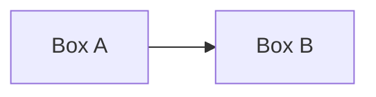

<figure class="post-hero">
  <svg viewBox="0 0 400 140" role="img" aria-labelledby="template-hero-title">
    <title id="template-hero-title">Placeholder hero illustration</title>
    <circle cx="200" cy="70" r="50" class="dg-box-accent" />
    <text x="200" y="70" class="dg-text">hero</text>
  </svg>
  <figcaption>Optional hero caption.</figcaption>
</figure>

## First section heading

Regular paragraph content goes here — normal Markdown, including **bold**,
_italics_, and [links](https://example.com).

## A section with a diagram

## A section with a table

| Column A | Column B |
|----------|----------|
| Row 1    | Value    |
| Row 2    | Value    |

## Wrapping up

Closing thoughts.
